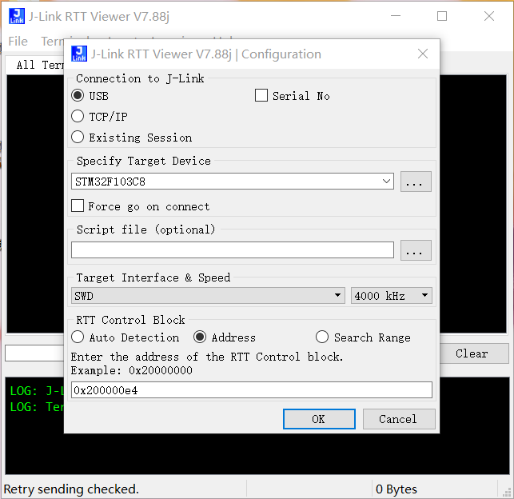

```

```

# 1. STM32F103_TIM_Encode

STM32F103C8T6 利用定时器的编码模式识别转速和方向 ，MDK工程

## 1.1 利用TIM实现编码器功能

- 利用STM32F103 定时器TIM3的编码器模式识别编码器的旋转角度。 输入引脚 PA0、 PA1 分别识别编码器A、 B 相的输出。
- PA2配置外部中断模式，捕获Z相的脉冲;

## 1.2 利用TIM 输出PWM

* 配置TIM1. 周期COUNT值50000. TIM1计数始终为36M Hz。所以生成的PWM频率为1440kHz
* TIM1的通道2 和 通道3对应 PB14、 PB15。目前通过控制PB15的占空比控制电机速度；发现配置通道2的时候，串口输出数据乱码 原因待确定

## 1.3 按键

* PA0引脚也是按键输入. 配置EXTI模式，默认拉高, 按下时拉低，；

## 1.4 LED

* 板子有两个LED灯PC13、 PD2。可以利用PC13控制电机的方向
* LED高电平灭

## 1.5 串口配置

* 利用STM32的串口1实现串口通信
* 引脚为PA9(TX)、 PA10(RX)

# 2. 编码器器件说明

- 使用的编码器型号为: amron E6B2-CWZ3E
- 各颜色线定义如下表

| 线色 | 端子名称 |     |
| ---- | -------- | --- |
| 褐色 | 电源+VCC |     |
| 黑色 | 输出A相  | PA0 |
| 白色 | 输出B相  | PA1 |
| 橙色 | 输出Z相  | PA2 |
| 蓝色 | GND      | GND |

- 编码器需要5~12V的直流输入

---

# 3. 通过SEGGER JLINK组件打印调试信息。

Jlink 连接后，可以通过Jlink打印调试信息。操作步骤如下：

- 在编译生成的 MDK-Proj\EncodeTIM4.map文件中 搜索 _SEGGER_RTT 的RAM地址,
- 打开J-LINK RTT Viewer，如下图设置，上一步查到的_SEGGER_RTT填入最后的 RTT Control block框中，点击OK即可查看调试信息

  
- 开发板上有5V输出引脚，该引脚与编码器的电源VCC相连即可。
- 目前编码器A/B相的输入是与开发板的PA0 PA1直接相连接的。而编码器A/B相的输出电压是5V, 开发板识别的电压是3.3V.所以有所隐患，但是实际测试可以正常运行。

# 4. PWM电机输出控制

- 电机型号：无刷直流电机 3920
- 该马达PWM高电平占空比越大 转速越慢，
- TIM_OCInitStructure.TIM_Pulse = CCR2_Val;  **CCR2_Val**值越小占空比越高。
- 目前占空比为 84% 时可正常以较慢转速运行, 占空比低于50%时，马达会速度会不稳定。所以占空比控制在55-84%之间
- 电机参数如下表

| 电压    | 空载电流      | 空载转速         |
| ------- | ------------- | ---------------- |
| 电压5V  | 空载电流0.12A | 空载转速1300转。 |
| 电压8V  | 空载电流0.16A | 空载转速2200转。 |
| 电压12V | 空载电流0.2A  | 空载转速3200转。 |

* 电机引脚定义说明

| 线色 | 端子名称    |      | 备注               |
| ---- | ----------- | ---- | ------------------ |
| 红色 | 电源正极    |      | 7 - 24 V           |
| 黄色 | 正反转切换  | PC13 |                    |
| 黑色 | 电源负极    | GND  |                    |
| 绿色 | FG信号输出  |      | 不同速度频率不同？ |
| 蓝色 | PWM信号输入 | PB15 | 接负极速度最快     |

# 5. 串口协议

    协议格式：$ANGST,aaa,bbb*hh\r\n

- 格式说明：
  - 指令统一以 '$' 符号作为帧头;
  - '$'之后五个字符作为帧标识符，指示指令类型, eg: ANGST表示设置角度指令;
  - ',' 作为指令内不同参数的分隔符;
  - '*hh\r\n'作为指令帧结束符号，hh为校验和(目前方便调试取消了校验和判断，校验和可随意写两个数字字符即可), \r\n为回车换行;

## 5.1 设置角度 ANGST

- 格式：$ANGST,xxxxx*hh\r\n
- 说明：

  | 格式 | 说明               | 备注                |
  | :---: | ------------------ | ------------------- |
  |   $   | 帧头               |                     |
  | ANDST | 帧标识符           |                     |
  |   ,   | 间隔符             |                     |
  | xxxxx | 参数1 设置的角度值 | 该值是实际角度乘100 |
  |   *   | 结束符             |                     |
  |  hh  | 校验和             |                     |
  | \r\n | 结束换行符号       |                     |

- 示例：$ANGST,9000*6A 表示设置角度值为90°

## 5.2 读取角度 ANGRD

- 格式：$ANGRD,xx*hh\r\n

- 说明：

  | 格式 | 说明         | 备注 |
  | :---: | ------------ | ---- |
  |   $   | 帧头         |      |
  | ANGRD | 帧标识符     | 表示读取当前设备角度     |
  |   ,   | 间隔符       |      |
  |  xx  | 预留参数,无意义 | 00   |
  |   *   | 结束符       |      |
  |  hh  | 校验和       |      |
  | \r\n | 结束换行符号 |      |
- 示例：$ANGRD,00*6A 表示读取当前设备角度, 返回格式参考
```c
printf("$ANGDA,%d,%d*5A\r\n", g_control._Angle, g_control.realAngle);
```
     -- 第二个参数为当前设备实际角度

## 5.3 设置PID PIDST
    设置PID参数

## 5.4 读取PID PIDRD
    读取PID参数

## 5.5 校准角度 ANCAL
    设置偏差角度

